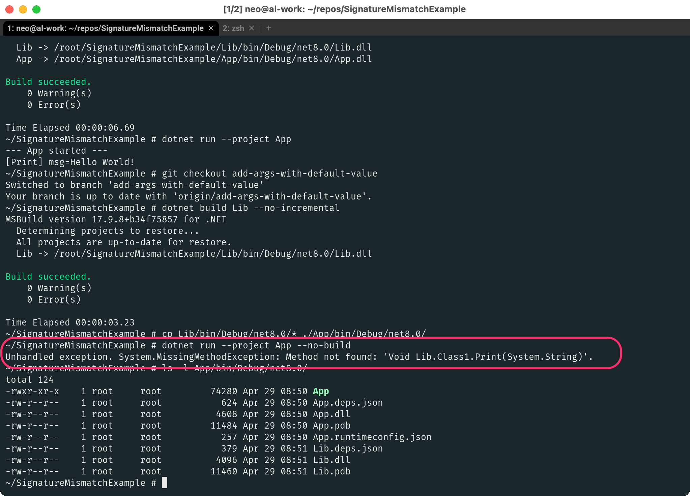
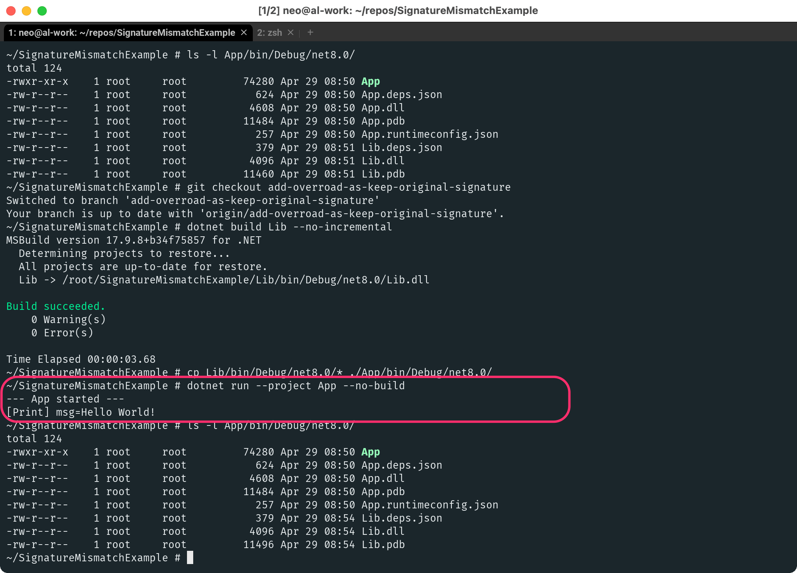
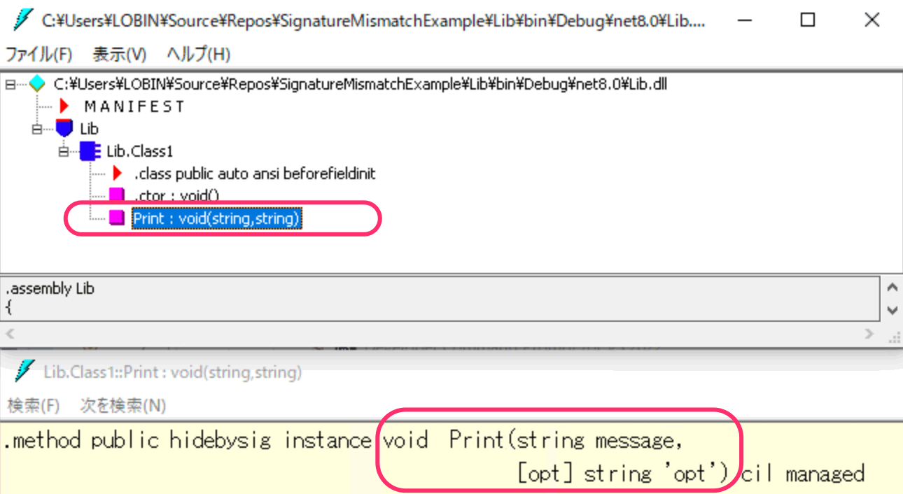

# SignatureMismatchExample
C#でのメソッドシグネチャのミスマッチを再現するサンプルコード

## 手順概要

```sh
# --- 準備 ---
# コンテナ起動
docker run -ti -e TZ=Asia/Tokyo --rm -w /root mcr.microsoft.com/dotnet/sdk:8.0-alpine3.18 sh

# リポジトリクローン
git clone https://github.com/lobin-z0x50/SignatureMismatchExample.git

cd SignatureMismatchExample/


# --- STEP.1 ---
# ソリューション全体（アプリとライブラリ）をビルド
dotnet build --no-incremental

# アプリを実行 → 問題なし
dotnet run --project App


# --- STEP.2 ---
# ブランチ変更
git checkout add-args-with-default-value

# ライブラリだけをリビルド
dotnet build Lib --no-incremental

# アプリをリビルドせず、DLLだけをコピー
cp Lib/bin/Debug/net8.0/* ./App/bin/Debug/net8.0/

# アプリを実行 → 問題発生
dotnet run --project App --no-build


# 状況確認（App.dll のほうが更新日時が古いはず）
ls -l App/bin/Debug/net8.0/
```



以下のようなエラーが発生します。
```
Unhandled exception. System.MissingMethodException: Method not found: 'Void Lib.Class1.Print(System.String)'.
```

`App` アプリからは、 `Lib.dll` の中から `Void Lib.Class1.Print(System.String)` というシグネチャのメソッドに依存しているので、
これが見つからないというエラーになっています。


### オーバーロード版を試す

次にブランチ `add-overroad-as-keep-original-signature` に切り替え、
同様にライブラリだけリビルドしてみます。

```sh
# --- STEP.3 ---
# 再度ブランチ変更
git checkout add-overroad-as-keep-original-signature

# ライブラリだけをリビルド
dotnet build Lib --no-incremental

# アプリをリビルドせず、DLLだけをコピー
cp Lib/bin/Debug/net8.0/* ./App/bin/Debug/net8.0/

# アプリを実行 → 問題なし
dotnet run --project App --no-build


# 状況確認（App.dll のほうが更新日時が古いはず）
ls -l App/bin/Debug/net8.0/
```




## 解説

`App` アプリからは、 `Lib.dll` の中から `Void Lib.Class1.Print(System.String)` というシグネチャのメソッドに依存しているので、
これが見つからないというエラーになっています。

STEP.2 でビルドした `Lib.dll` をアセンブリビューワ `ildasm` で開いてみると
以下のようになっています。



`void Print(string message, [opt] string 'opt')` という定義になっているため、
引数が１つの `Print` メソッドは存在せず、
引数が２つのものしかありません。

したがって、`App` アプリのロード時に 呼び出すべき `Print` メソッドが見つからず、エラーが発生しています。


